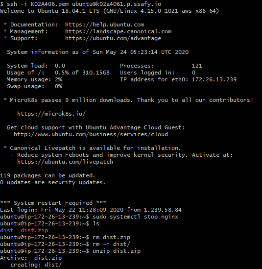
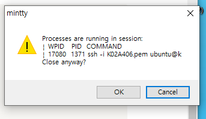

# HTTPS 배포하기

1. HTTP
2. HTTPS
3. WAS
4. MySQL 설치 및 연결 설정
5. Django 배포
6. Vue 배포
7. Nginx
8. Domain 구매, ELB 사용하기
9. Front AWS 재배포하기


## 1. HTTP

### Heroku

- [MDN Django 튜토리얼 파트 11: Django 웹사이트 공개하기](https://developer.mozilla.org/ko/docs/Learn/Server-side/Django/Deployment)


## 2. HTTPS

- [초보몽키, HTTPS와 SSL 인증서, SSL 동작방법](https://wayhome25.github.io/cs/2018/03/11/ssl-https/)
- [[Deploy] - 서버사이드 HTTPS 환경으로 배포하기(AWS)](https://velog.io/@zeros0623/%EC%84%9C%EB%B2%84%EC%82%AC%EC%9D%B4%EB%93%9C-HTTPS-%ED%99%98%EA%B2%BD%EC%9C%BC%EB%A1%9C-%EB%B0%B0%ED%8F%AC%ED%95%98%EA%B8%B0-ahk4mcv5a4)

### Domain & SSL

- [[AWS의 기본 08] EC2 인스턴스에 도메인 연결 (Route53)](https://wingsnote.com/57)
- [무료도메인과 AWS Certificate Manager(ACM)를 이용해서 SSL 인증서 얻기](https://velog.io/@zeros0623/%EB%AC%B4%EB%A3%8C%EB%8F%84%EB%A9%94%EC%9D%B8%EA%B3%BC-AWS-Certificate-ManagerACM%EB%A5%BC-%EC%9D%B4%EC%9A%A9%ED%95%B4%EC%84%9C-SSL-%EC%9D%B8%EC%A6%9D%EC%84%9C-%EC%96%BB%EA%B8%B0-rdk4meryd4) ✔
- [AWS, 자습서: Amazon Linux 2에서 SSL/TLS 구성](https://docs.aws.amazon.com/ko_kr/AWSEC2/latest/UserGuide/SSL-on-amazon-linux-2.html)

- [certbot 공식](https://certbot.eff.org/lets-encrypt/ubuntuxenial-nginx.html)
- [Ubuntu-Nginx-환경에서-CertBot을-사용하여-https-사용하기](https://velog.io/@pinot/Ubuntu-Nginx-%ED%99%98%EA%B2%BD%EC%97%90%EC%84%9C-CertBot%EC%9D%84-%EC%82%AC%EC%9A%A9%ED%95%98%EC%97%AC-https-%EC%82%AC%EC%9A%A9%ED%95%98%EA%B8%B0) ✔
- [Lets' Encrypt로 무료로 HTTPS 지원하기](https://blog.outsider.ne.kr/1178)
- [Certbot으로 무료 인증서 발급 받기](https://elfinlas.github.io/2018/03/19/certbot-ssl/) ✔
- [무료 SSL 보안 인증서 발급받기 (Free SSL Certificate)](https://apost.kr/327)
- [Nginx SSL]([Nginx] HTTPS (SSL))
- [Serving Django apps behind SSL with Nginx.md](http://nginx.md/https://gist.github.com/davewongillies/6897161)


## 3. WAS

- [WSGI, WAS, CGI 이해](https://brownbears.tistory.com/350)

### uWSGI

- [uwsgi의 역할은?](https://medium.com/@shdotseo/uwsgi%EC%9D%98-%EC%97%AD%ED%99%9C%EC%9D%80-c0ffe2920391)
- [django 와 WSGI 와 NGINX Python](https://crystalcube.co.kr/205)
- [WSGI에 대한 설명, WSGI란 무엇인가?  각 wsgi 특징](https://paphopu.tistory.com/37)
- [[처음부터 시작하는 EC2] nginx와 uwsgi로 django 서비스하기](https://yuddomack.tistory.com/entry/%EC%B2%98%EC%9D%8C%EB%B6%80%ED%84%B0-%EC%8B%9C%EC%9E%91%ED%95%98%EB%8A%94-EC2-nginx%EC%99%80-uwsgi%EB%A1%9C-django-%EC%84%9C%EB%B9%84%EC%8A%A4%ED%95%98%EA%B8%B0)


## 4. MySQL 설치 및 연결 설정

1. [AWS-EC2-Ubuntu-18.04에-Mysql-5.7-설치하기](https://velog.io/@loakick/AWS-EC2-Ubuntu-18.04%EC%97%90-Mysql-5.7-%EC%84%A4%EC%B9%98%ED%95%98%EA%B8%B0)
2. [[EC2] AWS EC2 MySQL 서버를 만들어보자!](https://luji.tistory.com/7)


## 5. Django 배포

1. [git 설치](https://ppost.tistory.com/entry/Ubuntu-Ubuntu%EC%97%90-Git-%EC%84%A4%EC%B9%98%ED%95%98%EA%B3%A0-%EC%82%AC%EC%9A%A9%ED%95%98%EA%B8%B0) 
2. [python3.7 및 venv 설치하기](https://softwaree.tistory.com/85)

    ```python
    $ sudo apt-get update
    $ sudo apt-get update -y
    $ sudo apt install build-essential
    $ sudo apt-get install nginx python3.7 python3-venv python3.7-dev default-libmysqlclient-dev

    $ source venv/bin/activate
    (venv)
    $ pip install -r requirements.txt
    ```

3. [mysqlclient error 경우 python dev 등 버전 확인](https://pypi.org/project/mysqlclient/) 
4. ls -l 으로 venv [권한](https://m.blog.naver.com/PostView.nhn?blogId=occidere&logNo=220816793990&proxyReferer=https:%2F%2Fwww.google.com%2F) 확인하기. venv 설치 시 sudo 쓰면 root 로 작동한다.
5. [wsgi.py 에 venv 경로 넣어주기](https://twpower.github.io/49-how-to-use-newrelic-apm-in-pyenv-and-virtualenv)
    - 참고 /home/ubuntu/s02p31a406/wouldyouci_back

    ```python
    import sys
    sys.path.append('/home/ubuntu/s02p31a406/wouldyouci_back/venv/lib/python3.7/site-packages')
    ```

6. [How To Set Up Django with Postgres, Nginx, and Gunicorn on Ubuntu 16.04](https://www.digitalocean.com/community/tutorials/how-to-set-up-django-with-postgres-nginx-and-gunicorn-on-ubuntu-16-04)

- /home/ubuntu/s02p31a406/wouldyouci_back/static
- 왜 soket 으로 켠 링크로는 안 들어가지는걸까....
- [수정 참고 링크 - group name 때문 이었던것 같다](https://m.blog.naver.com/monkey5255/221565148698) ✔

    ```python
    [Unit]
    Description=gunicorn daemon
    After=network.target

    [Service]
    User=ubuntu
    Group=ubuntu
    WorkingDirectory=/home/ubuntu/s02p31a406/wouldyouci_back
    ExecStart=/home/ubuntu/s02p31a406/wouldyouci_back/venv/bin/gunicorn --access-logfile - --workers 3 --bind unix:/home/ubuntu/s02p31a406/wouldyouci_back/wouldyouci_back.sock wouldyouci_back.wsgi:application

    [Install]
    WantedBy=multi-user.target
    ~
    ```

- nginx 설정 변경
    - [proxy headers size 관련](https://computingforgeeks.com/how-to-solve-nginx-warn-could-not-build-optimal-proxy-headers-hash-error/)

    ```python
    server {
        listen 80;

        location = /favicon.ico { access_log off; log_not_found off; }
        location /static/ {
            root /home/ubuntu/s02p31a406/wouldyouci_back;
        }

    	  location / {
            root /home/ubuntu/s02p31a406/wouldyouci_back;
    			  proxy_headers_hash_max_size 512;
    		    proxy_headers_hash_bucket_size 128;

            proxy_set_header Host $http_host;
            proxy_set_header X-Real-IP $remote_addr;
            proxy_set_header X-Forwarded-For $proxy_add_x_forwarded_for;
            proxy_set_header X-Forwarded-Proto $scheme;
            proxy_pass http://unix:/home/ubuntu/s02p31a406/wouldyouci_back/wouldyouci_back.sock;
        }
    }
    ```

    sudo vim /etc/nginx/sites-available/wouldyouci_back

    sudo rm /etc/nginx/sites-enabled/wouldyouci_back

    sudo ln -s /etc/nginx/sites-available/wouldyouci_back /etc/nginx/sites-enabled

7. [gunicorn daemon 실행](https://velog.io/@devzunky/TIL-no.82-AWS-Django-Server-Deployment)

- gunicorn wouldyouci_back.wsgi:application --bind=0.0.0.0:8000 —daemon
- 또는 gunicorn.config 를 통해서 실행
- ps -ef | grep python

8. test

- [http://15.164.96.65/movie/85579/](http://15.164.96.65/movie/85579/)
- 15.164.96.65


## 6. Vue 배포

- [AWS입문(3)-배포 프론트 웹 서버](https://rosejam.github.io/aws/AWS(3)/)
- certbot 설치

    ```python
    $sudo apt-get update
    $sudo apt-get install software-properties-common
    $sudo add-apt-repository universe
    $sudo add-apt-repository ppa:certbot/certbot
    $sudo apt-get update
    ```

- SSL 인증서 발급 방법 (1)

    ```python
    $ sudo certbot certonly --standalone -d k02a4061.p.ssafy.io
    ```

    - 발급된 인증서 확인: sudo certbot certificates
- SSL 인증서 발급 방법 (2) - nginx 설정 바로 바꿔버리기

    ```python
    $sudo certbot --nginx -d k02a4061.p.ssafy.io
    ```

- 인증서 자동갱신 확인

    ```python
    $sudo certbot renew --dry-run
    ```

- HTTPS 에서 HTTP 로 요청을 보내면 에러가 난다.
    - [혼합 콘텐츠 방지](https://developers.google.com/web/fundamentals/security/prevent-mixed-content/fixing-mixed-content?hl=ko)

        


## 7. Nginx

```python
$ sudo service --status-all | grep nginx
$ ps -ef | grep nginx

# 설정파일 수정의 경우
$ nginx -s reload

# 프로세스를 바로 종료
$ nginx -s stop

# 현재 연결 중인 커넥션이 모두 완료될 때까지 기다린 후 종료
$ nginx -s quit
```

- [nginx bind to 0.0.0.0:80 error 해결하기](https://jootc.com/p/201806261346)

## 8. Domain 구매, ELB 사용하기

- Keyword: AWS, DNS, SSL, EC2, Certificate Manager, Load Balancer, Nginx, Django
- 로드밸런싱이란?
    - [[AWS] 로드밸런싱 알아보기](https://medium.com/harrythegreat/aws-%EB%A1%9C%EB%93%9C%EB%B0%B8%EB%9F%B0%EC%8B%B1-%EC%95%8C%EC%95%84%EB%B3%B4%EA%B8%B0-9fd0955f859e)
    - User → Domain → ELB (https:443) → Nginx (http:80) → Django(http:8000)

- [무료도메인과 AWS Certificate Manager(ACM)를 이용해서 SSL 인증서 얻기](https://velog.io/@zeros0623/%EB%AC%B4%EB%A3%8C%EB%8F%84%EB%A9%94%EC%9D%B8%EA%B3%BC-AWS-Certificate-ManagerACM%EB%A5%BC-%EC%9D%B4%EC%9A%A9%ED%95%B4%EC%84%9C-SSL-%EC%9D%B8%EC%A6%9D%EC%84%9C-%EC%96%BB%EA%B8%B0-rdk4meryd4) ✔
- [[초보자를 위한 AWS 웹구축] 7. ELB 생성하기- classic ELB](https://tech.cloud.nongshim.co.kr/2018/10/16/%EC%B4%88%EB%B3%B4%EC%9E%90%EB%A5%BC-%EC%9C%84%ED%95%9C-aws-%EC%9B%B9%EA%B5%AC%EC%B6%95-7-elb-%EC%83%9D%EC%84%B1%ED%95%98%EA%B8%B0-%EC%9E%91%EC%84%B1%EC%A4%91/)
- [[초보자를 위한 AWS 웹구축] 8. 무료 도메인으로 Route 53 등록 및 ELB 연결](https://tech.cloud.nongshim.co.kr/2018/10/16/%EC%B4%88%EB%B3%B4%EC%9E%90%EB%A5%BC-%EC%9C%84%ED%95%9C-aws-%EC%9B%B9%EA%B5%AC%EC%B6%95-8-%EB%AC%B4%EB%A3%8C-%EB%8F%84%EB%A9%94%EC%9D%B8%EC%9C%BC%EB%A1%9C-route-53-%EB%93%B1%EB%A1%9D-%EB%B0%8F-elb/)

- AWS ELB와 Nginx로 HTTPS 서버 구축하기 : [ELB application 부터 NGINX 설정 변경](https://medium.com/@vdongbin/aws-elb%EC%99%80-nginx%EB%A1%9C-https-%EC%84%9C%EB%B2%84-%EA%B5%AC%EC%B6%95%ED%95%98%EA%B8%B0-736b8c5ee76) ✔

- ELD 사용 영역 설정 오류로 발생한 error
    - [The load balancer generates an HTTP error](https://docs.aws.amazon.com/ko_kr/elasticloadbalancing/latest/application/load-balancer-troubleshooting.html#http-503-issues)
    - [HTTP 503: 서비스 사용 불가](https://docs.aws.amazon.com/elasticloadbalancing/latest/application/load-balancer-troubleshooting.html)
    - [Availability Zones for Your Application Load Balancer](https://docs.aws.amazon.com/elasticloadbalancing/latest/application/load-balancer-subnets.html)

    


## 9. Front AWS 재배포하기

1. .env 파일의 경로 등을 확인한다.
2. `npm run build`
3. dist 폴더를 압축한다. 
   
    - dist 폴더 안에서 하지 말고 dist 폴더 자체를 압축해서 압축 해제하면 dist/ 폴더가 생기도록
4. 교수님이 주신 K02A406.pem 파일을 다운로드하고, 그 위치에 [dist.zip](http://dist.zip) 파일을 둔다. 

    

5. 내 **로컬**, 위의 폴더에서 bash 창 열고 우분투에 접속

    ```python
    ssh -i K02A406.pem ubuntu@k02a4061.p.ssafy.io

    - 최초 로그인 시 뭐라뭐라 인증키 어쩌고 하는데 yes 하면 됨
    ```

6. **ubuntu,** 접속 된 것을 확인하고, 접속한 그 위치(~) 에서

    nginx 멈추고, 기존의 dist 폴더 및 압축 파일을 삭제

    ```python
    sudo systemctl stop nginx

    ls 
    ---> dist 폴더와 dist.zip 확인

    rm -r dist/

    rm dist.zip

    ls
    ---> 폴더가 비어있는 것을 확인
    ```

7. **로컬,** 위의 pem 파일 있던 폴더에서 다시 bash 창 열고

    [dist.zip](http://dist.zip) 파일을 ubuntu로 복사하겠다는 명령어 입력

    ```python
    scp -i K02A406.pem dist.zip ubuntu@k02a4061.p.ssafy.io:~/
    ```

 8. 다시 **ubuntu** 창에서 파일 압축한거 해제하고 폴더 생성 된 것 확인

```python
ls
---> dist.zip 생긴 것을 확인

upzip dist.zip
---> 뭐가 막 뜸

ls
--> dist/ 폴더 생긴 것을 확인
```

9.  nginx 재실행 및 잘 돌아가는지 확인하고 종료 (뭔가 잘 안 돌아가고 있는 것 같으면 현동 호출)

```python
sudo systemctl start nginx
sudo systemctl status nginx
```

- 사진 참고 1



- active 초록색 뜨고 있으면 잘 되고 있는 것


- 종료 버튼 누르고 종료하면 되는데 머라머라 경고창이 아래처럼 떠도 그냥 ok 누르면 됨!

    다른 경고창이 뜬다면 나도 모름.. 일단 캡쳐하십시오...

    